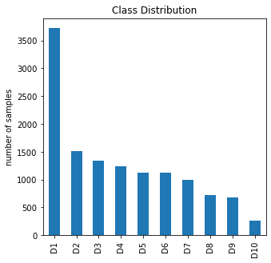

## Aim
To build a multi classification model for early detection of plant diseases, thereby improving crop yield and agricultural productivity

## Dataset

Dataset distribution for various classess in dataset.

## Result
Got accuracy of 0.98 on testing dataset and secured **Rank 10** Globally
